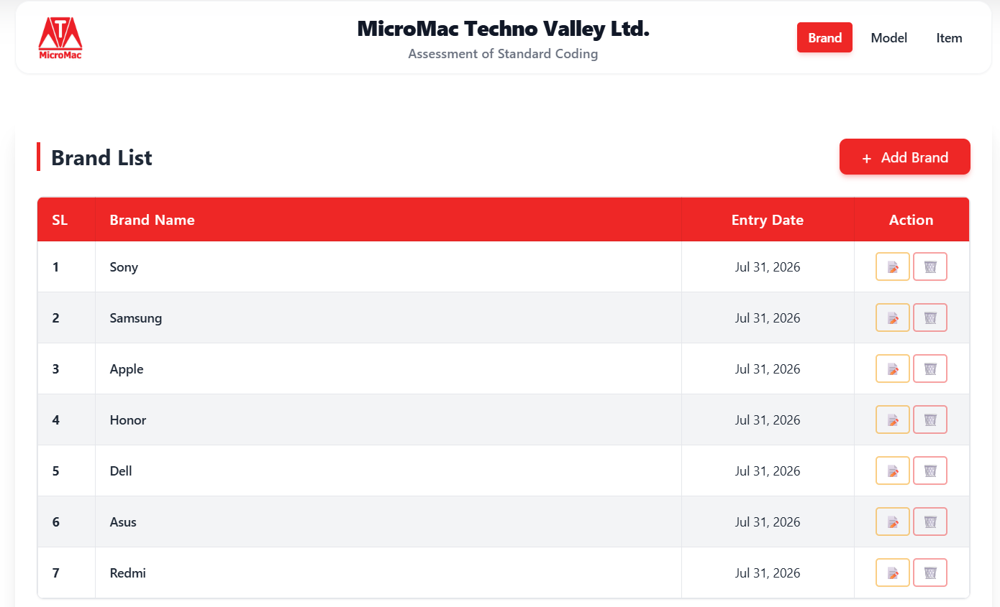
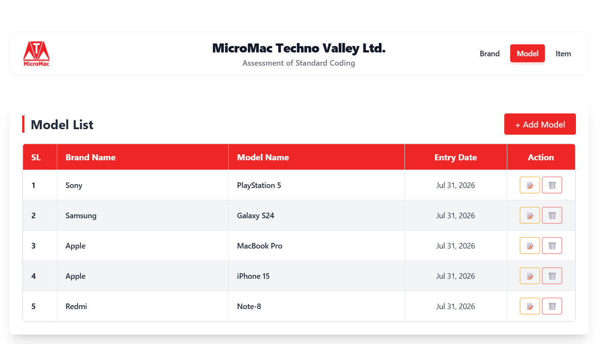
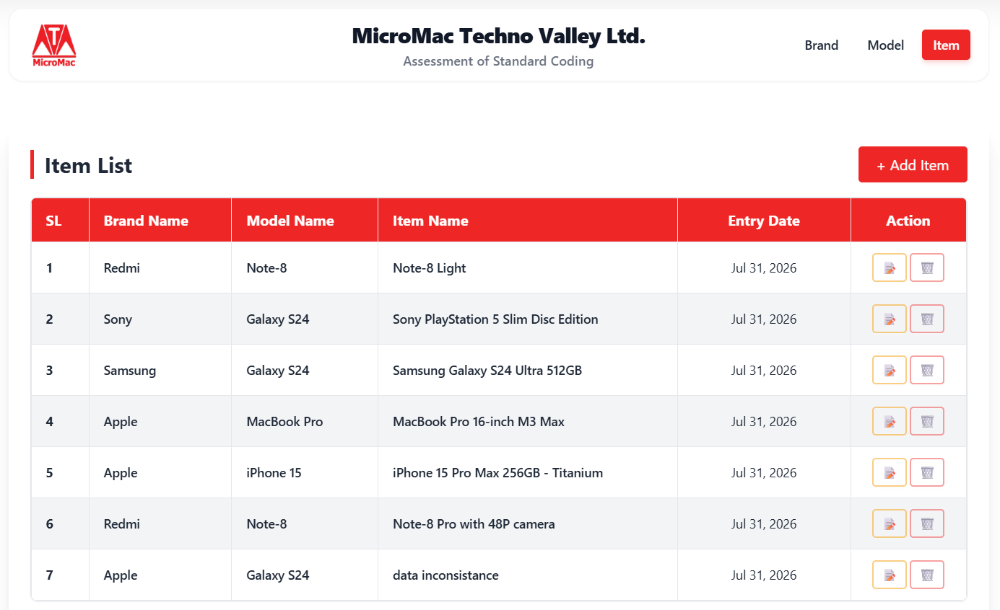
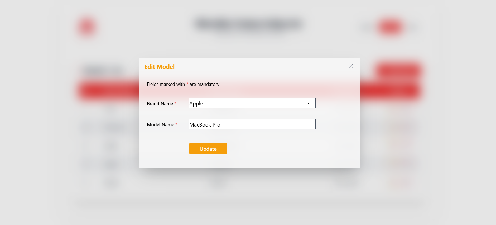

<div align="center">
  
  
  <br/><br/>
  <h1>🚀 Assessment of Standard Coding</h1>
  <h3>A Full-Stack Inventory Management System</h3>
  
  <p>
    Welcome to my submission for the MicroMac Techno Valley Ltd. assessment.<br/>
    This repository is more than just code—it is a showcase of my ability to architect robust database logic, write clean backend PHP, and design a premium, glassmorphism-inspired user interface.
  </p>

  <p>
    
    
    
    
  </p>
</div>

---

## 🎯 The Purpose & Vision
The goal of this project was to build a hierarchical **Brand → Model → Item** inventory manager. However, my vision was to execute this requirements list with absolute precision while elevating it to the standards of a modern SaaS application. It strictly adheres to professional coding architectures, raw SQL querying, dual-layer security, and an exceptionally smooth user experience.

---

## ⚙️ Architecture & Engineering Highlights

<table>
  <tr>
    <td width="50%" valign="top">
      <h3>🛡️ 1. Bulletproof Data Integrity</h3>
      <p><i>Preventing orphaned data before it happens.</i></p>
      <p>When adding a new item, the application enforces strict relational logic on the frontend. The Model dropdown is mathematically bound to the Brand selection—dynamically filtering in real-time via Javascript. This guarantees users can never select impossible combinations.</p>
    </td>
    <td width="50%" valign="top">
      <h3>🔄 2. Smart-Map Editing</h3>
      <p><i>Respecting the user's time.</i></p>
      <p>Clicking "Edit" intercepts the data row, grabs the existing database values, and perfectly maps them into the Edit Modal. It pre-triggers all dependent dropdown logic so absolutely no relational context is lost upon opening the modal.</p>
    </td>
  </tr>
  <tr>
    <td width="50%" valign="top">
      <h3>🔐 3. Dual-Layer Validation</h3>
      <p><i>Air-tight security protocols.</i></p>
      <ul>
        <li><b>Client-Side:</b> Real-time checks for empty fields, string lengths, and duplicates.</li>
        <li><b>Server-Side:</b> Laravel controllers aggressively re-validate all incoming requests.</li>
      </ul>
    </td>
    <td width="50%" valign="top">
      <h3>⚡ 4. Optimized Raw SQL</h3>
      <p><i>Built strictly to assessment constraints.</i></p>
      <p>Instead of relying on the Eloquent ORM, the Laravel DB Facade is utilized to execute raw, highly-optimized SQL queries (`DB::select`, `DB::insert`, `DB::update`) to demonstrate true database mastery.</p>
    </td>
  </tr>
</table>

---

## 🎨 UI/UX & Interface Showcase

This interface was designed with **Glassmorphism**, moving away from standard flat designs by utilizing subtle gradients, floating `backdrop-blur` containers, and non-blocking **Toast notifications** to replace jarring browser alerts. 

<details>
<summary><strong>📸 Click to expand the full visual gallery</strong></summary>
<br/>

<table>
  <tr>
    <td width="33%" align="center" valign="top">
      <b>1. Brand Dashboard</b><br/>
      
    </td>
    <td width="33%" align="center" valign="top">
      <b>2. Model Dashboard</b><br/>
      
    </td>
    <td width="33%" align="center" valign="top">
      <b>3. Item Dashboard</b><br/>
      
    </td>
  </tr>
  <tr>
    <td width="33%" align="center" valign="top">
      <b>4. Add Item (Dynamic Filtering)</b><br/>
      
    </td>
    <td width="33%" align="center" valign="top">
      <b>5. Smart Edit Modal</b><br/>
      
    </td>
    <td width="33%" align="center" valign="top">
      <b>6. Toast Notifications</b><br/>
      
    </td>
  </tr>
</table>

</details>

---

## 🚀 Installation & Database Setup

Want to run this locally? Follow these simple steps:

```bash
# 1. Clone the repository
git clone https://github.com/Md-Nur-A-Alam/your-repo-name.git
cd your-repo-name

# 2. Install dependencies
composer install

# 3. Environment setup
cp .env.example .env
php artisan key:generate
```

**4. Import the Database**
Update your `.env` file with your local MySQL credentials. Then, import the provided `codingtestmmtv.sql` file located in the root directory into your MySQL client. This instantly loads the required schemas and my pre-populated sample data!

```bash
# 5. Start the server
php artisan serve
```
*(Note: Tailwind CSS and DaisyUI are served via CDN, so `npm install` is not required!).*

---

## 👨‍💻 Meet the Developer

<table width="100%">
  <tr>
    <td width="20%" align="center">
      
    </td>
    <td width="80%">
      <h2>Md. Nur A Alam</h2>
      <p><b>Full-Stack Software Engineer</b> passionate about building highly scalable, secure, and visually stunning web applications.</p>
      
      <p>
        <a href="https://nur-dynamic-profile-client-beta.vercel.app/" target="_blank"></a>
        <a href="https://www.linkedin.com/in/md-nur-a-alam13/" target="_blank"></a>
        <a href="https://github.com/Md-Nur-A-Alam" target="_blank"></a>
      </p>
      <p>
        <a href="https://codeforces.com/profile/Nur_Alam.2812" target="_blank"></a>
        <a href="https://www.hackerrank.com/profile/md_nuralam2812" target="_blank"></a>
        <a href="https://judge.beecrowd.com/en/profile/630077" target="_blank"></a>
      </p>
      <p>
        <a href="https://web.facebook.com/Md.NurAAlamSoikot/" target="_blank"></a>
        <a href="https://www.youtube.com/@NurAAlam44" target="_blank"></a>
      </p>
    </td>
  </tr>
</table>

<br/>
<p align="center"><i>Thank you for reviewing my submission!</i></p>
